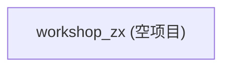

# Components Index

> **规则**: 本页只做导航 + 进度面板。模块的不变量、契约、证据链均在模块页（`components/{module}.md`）中。

## 模块清单

| 优先级 | 模块 | Owner | 代码入口 | 模块页 | 状态 |
|--------|------|-------|----------|--------|------|
| — | — | — | — | — | — |

**当前无模块**: 项目为初始化状态，无可识别代码模块。模块将在首次业务代码提交后通过 Delta Discover 补充。

## 依赖图

**无依赖关系**: 项目尚无模块，无可绘制依赖。

## 进度面板

- [ ] P0 模块: 0/0（无模块可覆盖）
- [ ] P1 模块: 0/0
- [ ] P2 模块: 0/0

## Evidence Gaps

- 缺失: 代码模块的识别与分类
- 期望粒度: 每个模块一个目录/包，有明确的入口文件
- 候选证据位置: 仓库 `src/`、`app/`、`internal/` 等代码目录（尚未创建）
- 影响: 无法建立模块地图，索引只能显示为空。待首次业务代码提交后通过 Delta Discover 补充。
