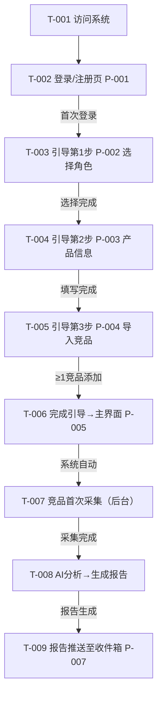
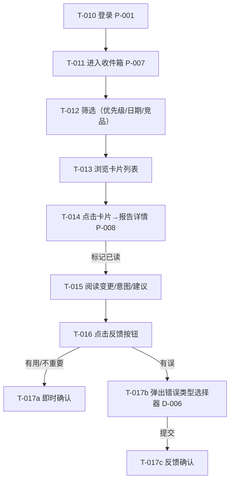
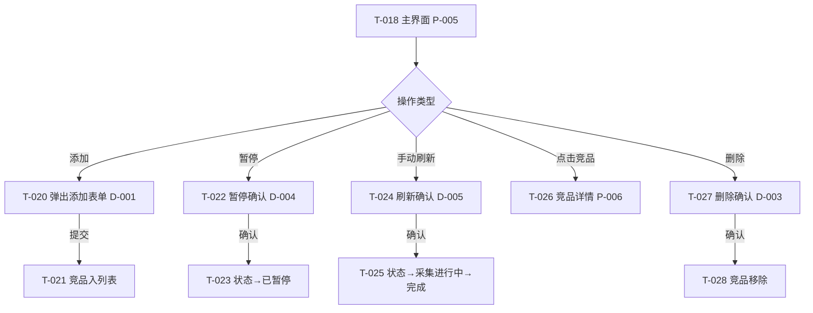

> 目的：把 `requirements/prd.md` 的核心场景/规则/AC，转写为可走查、可评审、可验证的交互说明。
> 规则：只写影响实现/验收的最小信息；不出现"待确认问题"——不确定性引用 PRD/solution 验证清单。

## 0. 基本信息

- 需求标识：001-lensmor-monitor
- 作者：AI Agent (spec-product-prototype)
- 状态：draft
- 最后更新：2026-06-17
- Figma 链接入口：无

---

## 1. 场景清单

| 场景编号 | 场景标题 | 成功标准 | 任务流节点 | 页面链路 | PRD AC |
|---------|---------|---------|-----------|---------|--------|
| S-001 | 新用户上手并获取第一份情报 | 5 分钟完成引导+添加竞品；系统自动采集并生成报告 | T-001~T-009 | P-001→P-002→P-003→P-004→P-005 | AC-001~005 |
| S-002 | 日常情报消费与反馈 | 收件箱≤2s 加载；打开详情≤3s；反馈即时确认 | T-010~T-017 | P-005→P-007→P-008→D-006 | AC-006~011 |
| S-003 | 竞品生命周期管理 | 添加/暂停/刷新即时生效；删除二次确认 | T-018~T-025 | P-005→D-001→D-004→D-005→D-003→P-006 | AC-012~016 |

---

## 2. 端到端任务流

### 2.1 S-001：新用户上手



### 2.2 S-002：日常情报消费



### 2.3 S-003：竞品生命周期管理



---

## 3. 页面/弹窗清单

| Node ID | 类型 | 名称/目的 | 入口 | 覆盖 T-xxx | 覆盖场景 | 备注 |
|---------|------|----------|------|-----------|---------|------|
| P-001 | P | 登录/注册 | 直接访问 | T-002, T-010 | S-001, S-002 | 未登录重定向至此 |
| P-002 | P | 引导第1步-角色选择 | P-001（首次登录后） | T-003 | S-001 | 含 6 角色选项 |
| P-003 | P | 引导第2步-产品信息 | P-002 | T-004 | S-001 | 7 字段表单 |
| P-004 | P | 引导第3步-导入竞品 | P-003 | T-005 | S-001 | 推荐列表+手动添加 |
| P-005 | P | 主界面 | P-004（引导完成）或 P-001（已引导用户） | T-006, T-011, T-018 | S-001, S-002, S-003 | 竞品侧边栏+内容区 |
| P-006 | P | 竞品详情 | P-005（点击竞品） | T-026 | S-003 | Overview 面板 |
| P-007 | P | 收件箱 | P-005（导航切换） | T-009, T-011, T-012, T-013 | S-001, S-002 | 卡片列表+详情面板 |
| P-008 | P | 报告详情 | P-007（点击卡片） | T-014, T-015, T-016 | S-002 | 变更/意图/建议 |
| D-001 | D | 添加竞品 | P-005（"+ 添加竞品"按钮） | T-020 | S-003 | 名称+URL+关联链接 |
| D-002 | D | 编辑竞品 | P-005（竞品右键/编辑按钮） | — | S-003 | 与 D-001 结构相同，预填数据 |
| D-003 | D | 删除确认 | P-005（竞品删除按钮） | T-027 | S-003 | 二次确认+不可逆提示 |
| D-004 | D | 暂停确认 | P-005（暂停按钮） | T-022 | S-003 | 说明暂停后果 |
| D-005 | D | 手动刷新确认 | P-005（刷新按钮） | T-024 | S-003 | 说明将重新采集 |
| D-006 | D | 反馈-错误类型选择 | P-008（"有误"按钮） | T-017b | S-002 | 8 种错误类型必选 |

---

## 4. 页面说明

### 4.1 P-001 登录/注册

#### 4.1.1 入口与目的

- **ID**：P-001
- **页面目的**：用户认证入口，未登录用户重定向至此
- **入口**：直接访问系统 URL
- **前置条件**：无（未登录状态）
- **涉及场景**：S-001, S-002

#### 4.1.2 ASCII 线框

```text
P-001 登录/注册
+------------------------------------------------------------+
|                                                            |
|                    [Lensmor Monitor Logo]                   |
|                    竞品情报监控平台                          |
|                                                            |
|   +------------------------------------------------------+ |
|   |  [ 登录 ]  [ 注册 ]    <-- Tab 切换                    | |
|   +------------------------------------------------------+ |
|   |                                                      | |
|   |  邮箱:  [________________________]                    | |
|   |         <错误提示: 邮箱格式不合法>                      | |
|   |                                                      | |
|   |  密码:  [________________________]                    | |
|   |         <错误提示: 密码不能为空>                        | |
|   |                                                      | |
|   |  [ 登录 ]                                             | |
|   |  <全局错误: 邮箱或密码错误，请重试>                      | |
|   +------------------------------------------------------+ |
|                                                            |
+------------------------------------------------------------+
```

#### 4.1.3 关键状态与反馈

| 状态 | 触发条件 | 界面要点 | 恢复路径 |
|------|---------|---------|---------|
| 正常 | 页面加载完成 | 默认显示登录 Tab | — |
| 加载 | 点击登录/注册按钮 | 按钮显示 loading 态，禁用点击 | 等待响应 |
| 错误（校验） | 邮箱格式不合法/密码为空 | 对应字段下方红色提示，按钮仍可点击 | 修正后重试 |
| 错误（服务端） | 邮箱或密码错误/注册邮箱已存在 | 表单顶部红色 banner 提示 | 修正后重试 |
| 错误（网络） | 请求超时/网络中断 | "网络错误，请检查连接后重试"+重试按钮 | 点击重试 |

#### 4.1.4 关键校验与错误处理

- 校验-1：邮箱格式——失去焦点时校验，不合法标红提示"请输入有效的邮箱地址"
- 校验-2：密码非空——提交时校验，为空标红提示"密码不能为空"
- 校验-3：注册密码长度 ≥8 位——提交时校验

#### 4.1.5 跳转与交互

- **登录成功后**：已引导用户→P-005 主界面；未引导用户→P-002 引导第1步
- **注册成功后**：自动登录→P-002 引导第1步
- **失败后**：保留输入内容，显示错误提示

---

### 4.2 P-002 引导第1步：选择角色

#### 4.2.1 入口与目的

- **ID**：P-002
- **页面目的**：新用户选择角色，影响后续情报解读角度
- **入口**：P-001 登录/注册成功后（首次用户）
- **前置条件**：已登录，未完成引导
- **涉及场景**：S-001

#### 4.2.2 ASCII 线框

```text
P-002 引导第1步：选择角色
+------------------------------------------------------------+
|  [Lensmor Monitor]                          步骤 1 / 3     |
+------------------------------------------------------------+
|                                                            |
|  欢迎！让我们了解你的角色，以便为你定制情报解读。             |
|                                                            |
|  选择你的角色：                                             |
|                                                            |
|  +------------------------------------------------------+ |
|  | (*) 产品营销经理                                      | |
|  +------------------------------------------------------+ |
|  +------------------------------------------------------+ |
|  | ( ) 产品经理                                          | |
|  +------------------------------------------------------+ |
|  +------------------------------------------------------+ |
|  | ( ) 市场营销经理                                      | |
|  +------------------------------------------------------+ |
|  +------------------------------------------------------+ |
|  | ( ) 创始人                                            | |
|  +------------------------------------------------------+ |
|  +------------------------------------------------------+ |
|  | ( ) 投资人                                            | |
|  +------------------------------------------------------+ |
|  +------------------------------------------------------+ |
|  | ( ) 其他                                              | |
|  +------------------------------------------------------+ |
|                                                            |
|  <错误提示: 请选择一个角色>                                 |
|                                                            |
|                              [ 下一步 ]                     |
+------------------------------------------------------------+
```

#### 4.1.3 关键状态与反馈

| 状态 | 触发条件 | 界面要点 | 恢复路径 |
|------|---------|---------|---------|
| 正常 | 进入页面 | 6 个角色卡片单选，默认无选中 | — |
| 校验失败 | 未选择点击"下一步" | 底部红色提示"请选择一个角色" | 选择后重试 |

#### 4.1.5 跳转与交互

- **成功后**：→ P-003 引导第2步
- **不支持返回**：引导第1步无上一步（首次设置）

---

### 4.3 P-003 引导第2步：填写自有产品信息

#### 4.3.1 入口与目的

- **ID**：P-003
- **页面目的**：收集自有产品信息，作为竞品分析的上下文
- **入口**：P-002 选择角色后
- **前置条件**：已完成角色选择
- **涉及场景**：S-001

#### 4.3.2 ASCII 线框

```text
P-003 引导第2步：自有产品信息
+------------------------------------------------------------+
|  [Lensmor Monitor]                          步骤 2 / 3     |
+------------------------------------------------------------+
|                                                            |
|  告诉我们你的产品信息，系统会站在你的角度分析竞品变化。       |
|                                                            |
|  产品名称*:  [______________________________]               |
|              <必填提示>                                     |
|                                                            |
|  产品 URL*:  [______________________________]               |
|              <格式校验失败: 请输入有效的URL>                  |
|                                                            |
|  一句话描述: [______________________________]               |
|                                                            |
|  目标受众:   [______________________________]               |
|                                                            |
|  核心卖点:   [______________________________]               |
|                                                            |
|  竞争优势:   [______________________________]               |
|                                                            |
|  当前阶段:   [ 选择 v ]  <-- 下拉: 探索期/成长期/成熟期/...  |
|                                                            |
|                              [ 上一步 ]   [ 下一步 ]         |
+------------------------------------------------------------+
```

#### 4.3.3 关键状态与反馈

| 状态 | 触发条件 | 界面要点 | 恢复路径 |
|------|---------|---------|---------|
| 正常 | 进入页面 | 空表单，仅必填项标注* | — |
| 校验失败 | 必填项为空或URL格式不合法 | 对应字段标红+下方提示；"下一步"不可点击或点击后滚动到首个错误 | 修正后重试 |

#### 4.3.5 跳转与交互

- **成功后**：→ P-004 引导第3步
- **返回**：→ P-002（保留已填写信息）

---

### 4.4 P-004 引导第3步：导入竞品

#### 4.4.1 入口与目的

- **ID**：P-004
- **页面目的**：帮助用户快速添加首批监控竞品
- **入口**：P-003 填写产品信息后
- **前置条件**：已完成产品信息填写
- **涉及场景**：S-001

#### 4.4.2 ASCII 线框

```text
P-004 引导第3步：导入竞品
+------------------------------------------------------------+
|  [Lensmor Monitor]                          步骤 3 / 3     |
+------------------------------------------------------------+
|                                                            |
|  我们根据你的产品为你推荐了以下竞品，勾选你想监控的：         |
|                                                            |
|  推荐竞品（基于你的产品 URL）：           [手动添加竞品]     |
|  +------------------------------------------------------+ |
|  | [x] Competitor A  competitor-a.com                    | |
|  | [x] Competitor B  competitor-b.com                    | |
|  | [ ] Competitor C  competitor-c.com                    | |
|  | [ ] Competitor D  competitor-d.com                    | |
|  +------------------------------------------------------+ |
|                                                            |
|  手动添加的竞品：                                           |
|  +------------------------------------------------------+ |
|  | My Competitor  my-competitor.com            [删除]     | |
|  +------------------------------------------------------+ |
|                                                            |
|  已选择 3 个竞品                                           |
|                                                            |
|  <提示: 请至少添加 1 个竞品>                                 |
|                                                            |
|                              [ 上一步 ]   [ 开始监控 ]       |
+------------------------------------------------------------+
```

#### 4.4.3 关键状态与反馈

| 状态 | 触发条件 | 界面要点 | 恢复路径 |
|------|---------|---------|---------|
| 正常 | 进入页面 | 推荐列表展开，默认全选 | — |
| 加载（推荐） | 正在获取推荐列表 | 推荐区域显示骨架屏/loading | 等待 |
| 空（推荐） | 无推荐结果 | "未找到推荐竞品，请手动添加" | 手动添加 |
| 校验失败 | 未选择任何竞品点击"开始监控" | 底部红色提示"请至少添加 1 个竞品" | 勾选或手动添加 |

#### 4.4.4 关键校验与错误处理

- 校验-1：手动添加竞品——URL 必填且格式合法，名称必填
- 校验-2：最终提交前检查≥1 个竞品（推荐勾选+手动添加合计）

#### 4.4.5 跳转与交互

- **"开始监控"成功后**：→ P-005 主界面，侧边栏显示已添加竞品，后台触发首次采集
- **返回**：→ P-003（保留已勾选/手动添加的竞品）
- **手动添加**：弹出简化版 D-001（内联表单或小型弹窗）

---

### 4.5 P-005 主界面

#### 4.5.1 入口与目的

- **ID**：P-005
- **页面目的**：用户日常操作的枢纽——左侧竞品管理，右侧内容区
- **入口**：引导完成后 / 已引导用户登录后
- **前置条件**：已登录，已完成引导
- **涉及场景**：S-001, S-002, S-003

#### 4.5.2 ASCII 线框

```text
P-005 主界面（默认：竞品管理视图）
+------------------------------------------------------------------+
| [Lensmor Monitor]  竞品管理 | 收件箱          [用户头像 v]        |
+------------------------------------------------------------------+
| 左侧边栏 (280px)           | 右侧内容区                           |
|                            |                                      |
| 竞品列表          [+ 添加] |  <-- 默认展示：选择竞品后的详情或     |
| +------------------------+ |           空状态引导                  |
| | [Logo] Competitor A   | |                                      |
| |        监控中 ●        | |  +-------------------------------+  |
| +------------------------+ |  |                               |  |
| +------------------------+ |  |   请从左侧选择一个竞品          |  |
| | [Logo] Competitor B   | |  |   查看详情，或点击"+ 添加"     |  |
| |        已暂停 ◐        | |  |   添加新的竞品                 |  |
| +------------------------+ |  |                               |  |
| +------------------------+ |  +-------------------------------+  |
| | [Logo] Competitor C   | |                                      |
| |        采集进行中 ◷    | |                                      |
| +------------------------+ |                                      |
|                            |                                      |
+------------------------------------------------------------------+
```

#### 4.5.3 关键状态与反馈（左侧边栏）

| 状态 | 触发条件 | 界面要点 | 恢复路径 |
|------|---------|---------|---------|
| 正常 | 页面加载 | 竞品列表展示，默认选中第一个或上次选中项 | — |
| 加载 | 初次加载竞品列表 | 列表区域骨架屏 | 等待 |
| 空 | 用户无竞品（异常情况——引导后不应出现） | "还没有竞品，点击+添加"引导文案 | 点击+添加 → D-001 |
| 竞品状态-监控中 | 正常监控 | 绿色圆点+文字"监控中" | — |
| 竞品状态-已暂停 | 用户暂停监控 | 橙色半圆+文字"已暂停" | 点击"恢复" |
| 竞品状态-采集进行中 | 手动刷新或定时采集触发 | 蓝色旋转图标+文字"采集进行中" | 自动恢复 |

#### 4.5.4 关键校验与错误处理

- 校验-1：竞品名称过长——列表截断+省略号+ hover tooltip 显示全名

#### 4.5.5 跳转与交互

- **点击竞品**：右侧展示 P-006 竞品详情
- **点击"+ 添加"**：弹出 D-001 添加竞品
- **点击竞品右侧"…"菜单**：编辑(D-002) / 暂停(D-004) / 手动刷新(D-005) / 删除(D-003)
- **导航切换"收件箱"**：→ P-007 收件箱视图
- **暂停竞品**：弹出 D-004 → 确认后状态变更
- **手动刷新**：弹出 D-005 → 确认后状态变为"采集进行中"
- **删除竞品**：弹出 D-003 → 确认后移除

---

### 4.6 P-006 竞品详情（Overview）

#### 4.6.1 入口与目的

- **ID**：P-006
- **页面目的**：展示竞品综合概况——公司基本面 + 最新情报时间线
- **入口**：P-005 点击竞品列表项
- **前置条件**：已登录，已选择竞品
- **涉及场景**：S-003

#### 4.6.2 ASCII 线框

```text
P-006 竞品详情：Competitor A
+------------------------------------------------------------------+
| [Lensmor Monitor]  竞品管理 | 收件箱          [用户头像 v]        |
+------------------------------------------------------------------+
| 左侧边栏                 | 右侧详情（Overview）                    |
| （同 P-005）             |                                        |
|                          | Competitor A                           |
|                          | competitor-a.com    [暂停] [刷新] [编辑]|
|                          |                                        |
|                          | --- 公司基本面 ---                      |
|                          | 成立时间: 2015年                        |
|                          | 公司类型: 私有                          |
|                          | 融资阶段: C轮                           |
|                          | 所在地: 旧金山, CA                       |
|                          | 员工规模: 500-1000                       |
|                          | 目标细分: 企业SaaS                       |
|                          | 领英: linkedin.com/company/competitor-a   |
|                          |                                        |
|                          | --- 最新情报 ---                        |
|                          | +-------------------------------------+ |
|                          | | 2026-06-15  紧急                    | |
|                          | | 定价页新增Enterprise套餐...          | |
|                          | +-------------------------------------+ |
|                          | +-------------------------------------+ |
|                          | | 2026-06-10  中等                    | |
|                          | | 首页改版，强调AI能力...              | |
|                          | +-------------------------------------+ |
|                          |          [查看更多情报 → 收件箱]        |
+------------------------------------------------------------------+
```

#### 4.6.3 关键状态与反馈

| 状态 | 触发条件 | 界面要点 | 恢复路径 |
|------|---------|---------|---------|
| 正常 | 数据正常 | 基本面字段+情报时间线 | — |
| 加载 | 切换竞品 | 右侧内容区骨架屏 | 等待 |
| 空（基本面） | MVP 允许部分字段为空 | 显示"—"或"暂无数据" | 用户可编辑补充 |
| 空（情报） | 尚未生成报告 | "暂无情报，系统正在监控中" | 等待采集完成或手动刷新 |
| 错误 | 加载失败 | 错误提示+重试按钮 | 点击重试 |

#### 4.6.5 跳转与交互

- **"查看更多情报"**：→ P-007 收件箱（预设该竞品筛选）
- **暂停/刷新/编辑**：弹出对应弹窗 D-004/D-005/D-002
- **点击时间线卡片**：→ P-008 报告详情

---

### 4.7 P-007 收件箱

#### 4.7.1 入口与目的

- **ID**：P-007
- **页面目的**：情报消费核心模块——浏览、筛选、阅读分析报告
- **入口**：P-005 顶部导航切换"收件箱"
- **前置条件**：已登录
- **涉及场景**：S-001, S-002

#### 4.7.2 ASCII 线框

```text
P-007 收件箱
+------------------------------------------------------------------+
| [Lensmor Monitor]  竞品管理 | [收件箱]        [用户头像 v]        |
+------------------------------------------------------------------+
| 筛选栏                                                           |
| 优先级: [全部 v]  日期: [2026-06-01] ~ [2026-06-17]  竞品: [全部 v]|
+------------------------------------------------------------------+
| 左侧卡片列表 (380px)       | 右侧详情面板                         |
|                            |                                      |
| +------------------------+ |  <-- 默认空状态                      |
| | [未读●] 紧急           | |  +-------------------------------+  |
| | Competitor A 定价变更   | |  |                               |  |
| | 2026-06-15             | |  |   请从左侧选择一份报告          |  |
| +------------------------+ |  |   查看详细分析                  |  |
| +------------------------+ |  |                               |  |
| | [未读●] 中等           | |  +-------------------------------+  |
| | Competitor B 首页改版   | |                                      |
| | 2026-06-14             | |                                      |
| +------------------------+ |                                      |
| +------------------------+ |                                      |
| | [已读] 低影响           | |                                      |
| | Competitor A 博客更新   | |                                      |
| | 2026-06-10             | |                                      |
| +------------------------+ |                                      |
|                            |                                      |
| +---- 加载更多 ----+       |                                      |
+------------------------------------------------------------------+
```

#### 4.7.3 关键状态与反馈

| 状态 | 触发条件 | 界面要点 | 恢复路径 |
|------|---------|---------|---------|
| 正常 | 有报告 | 卡片列表+详情面板 | — |
| 加载 | 初次加载/切换筛选 | 列表区域骨架屏 | 等待 |
| 加载更多 | 滚动到底部 | 底部"加载中…" | 自动追加 |
| 空（全量） | 从未生成报告 | 插画+"还没有情报报告，系统正在监控中，请稍后查看" | 等待采集 |
| 空（筛选后） | 筛选条件无匹配 | "没有符合条件的情报，尝试调整筛选条件" | 调整筛选 |
| 错误 | 加载失败 | 错误提示+重试按钮 | 重试 |

#### 4.7.4 关键校验与错误处理

- 校验-1：日期范围——结束日期不能早于开始日期

#### 4.7.5 跳转与交互

- **点击卡片**：右侧展示 P-008 报告详情，卡片标记已读（蓝色标记点消失）
- **筛选变更**：即时刷新卡片列表
- **点击"竞品管理"导航**：→ P-005

---

### 4.8 P-008 报告详情

#### 4.8.1 入口与目的

- **ID**：P-008
- **页面目的**：展示完整的分析报告——变更摘要、战略意图、行动建议
- **入口**：P-007 点击卡片 / P-006 点击时间线卡片
- **前置条件**：已登录，已选择报告
- **涉及场景**：S-002

#### 4.8.2 ASCII 线框

```text
P-008 报告详情（在 P-007 右侧面板展示）
+------------------------------------------------------------------+
|                           ...（同 P-007 布局）                     |
+------------------------------------------------------------------+
| 左侧卡片列表             | 右侧详情面板                           |
| （同 P-007）             |                                        |
|                          | Competitor A · 定价变更                |
|                          | 2026-06-15  [紧急]  [查看原始网站 ↗]   |
|                          |                                        |
|                          | --- 发生了什么变化 ---                 |
|                          | 1. 定价页新增 Enterprise 套餐，$999/月  |
|                          | 2. 移除 Free 套餐，最低 $29/月起       |
|                          | 3. 新增"联系销售"入口替代自助购买       |
|                          |                                        |
|                          | --- 战略意图分析 ---                    |
|                          | Competitor A 正在从自助PLG转向企业销售  |
|                          | 驱动，目标客群从中小团队转向中大型企业。 |
|                          | 移除免费套餐表明他们正在筛选高价值客户。 |
|                          |                                        |
|                          | --- 行动建议 ---                       |
|                          | [紧急] 评估你的定价是否仍有竞争力       |
|                          |   理由: 竞品最低门槛从$0→$29，你仍提供  |
|                          |   Free 套餐，可在竞品客户流失期获客      |
|                          | [中等] 关注竞品Enterprise功能列表        |
|                          |   理由: 了解企业级需求趋势，为你的产品    |
|                          |   路线图提供参考                         |
|                          | [低] 监控竞品客户评价变化                 |
|                          |                                        |
|                          | --- 反馈 ---                           |
|                          | 这条情报对你有用吗？                     |
|                          | [有用]  [有误]  [不重要]                |
+------------------------------------------------------------------+
```

#### 4.8.3 关键状态与反馈

| 状态 | 触发条件 | 界面要点 | 恢复路径 |
|------|---------|---------|---------|
| 正常 | 数据加载完成 | 4 个区域完整展示 | — |
| 加载 | 切换报告 | 详情区域骨架屏 | 等待 |
| 错误 | 加载失败 | 错误提示+重试按钮 | 重试 |
| 反馈提交中 | 点击反馈按钮 | 按钮 loading 态 | 等待 |
| 反馈成功 | 提交成功 | 按钮变灰+绿色"感谢反馈" | — |
| 反馈失败 | 提交失败 | toast 错误提示，按钮恢复 | 重试 |

#### 4.8.4 关键校验与错误处理

- 校验-1："有误"必须选择错误类型——弹出 D-006，未选择时"提交"不可点击

#### 4.8.5 跳转与交互

- **"查看原始网站"**：新标签页打开竞品网站 URL
- **"有用"/"不重要"**：即时 toast 确认
- **"有误"**：弹出 D-006 错误类型选择器 → 选择后提交 → toast 确认

---

### 4.9 弹窗集合

#### D-001/D-002 添加/编辑竞品

```text
D-001 添加竞品
+------------------------------------------+
|  添加竞品                          [X]    |
+------------------------------------------+
|                                          |
|  竞品名称*: [___________________]         |
|             <必填提示>                    |
|                                          |
|  主域名*:   [___________________]         |
|             <格式校验失败提示>             |
|                                          |
|  关联链接（选填，上限 10 条）:             |
|  +------------------------------------+  |
|  | [___________________]        [删除] |  |
|  | [___________________]        [删除] |  |
|  +------------------------------------+  |
|  [+ 添加链接]  <-- 达上限后置灰           |
|                                          |
|                      [取消]  [确认添加]   |
+------------------------------------------+
```

#### D-003 删除确认

```text
D-003 删除确认
+------------------------------------------+
|  确认删除                          [X]    |
+------------------------------------------+
|                                          |
|  ⚠ 删除后将无法恢复该竞品的历史数据和     |
|    报告，确认删除 Competitor A？          |
|                                          |
|                      [取消]  [确认删除]   |
+------------------------------------------+
```

#### D-004 暂停确认

```text
D-004 暂停监控确认
+------------------------------------------+
|  暂停监控                          [X]    |
+------------------------------------------+
|                                          |
|  暂停后系统将停止对 Competitor A 的       |
|  定时采集。你可以随时恢复监控。           |
|                                          |
|                      [取消]  [确认暂停]   |
+------------------------------------------+
```

#### D-005 手动刷新确认

```text
D-005 手动刷新确认
+------------------------------------------+
|  手动刷新                          [X]    |
+------------------------------------------+
|                                          |
|  将立即对 Competitor A 执行全量采集      |
|  并生成最新分析报告。                    |
|                                          |
|                      [取消]  [确认刷新]   |
+------------------------------------------+
```

#### D-006 反馈-错误类型选择器

```text
D-006 反馈：这条情报有什么问题？
+------------------------------------------+
|  请选择错误类型（必选）:            [X]   |
+------------------------------------------+
|                                          |
|  ( ) 信息不准确                          |
|  ( ) 内容不相关                          |
|  ( ) 数据过时                            |
|  ( ) 信息重复                            |
|  ( ) 战略意图有误                        |
|  ( ) 遗漏关键变更                        |
|  ( ) 噪音过多                            |
|  ( ) 源数据不准确                        |
|                                          |
|                      [取消]  [提交反馈]   |
+------------------------------------------+
```

---

## 5. AC → 交互节点映射

| AC-ID | 场景 | T-xxx | 页面/节点 | 验证点 |
|-------|------|-------|-----------|--------|
| AC-001 | S-001 | T-003 | P-002 | 6 角色选项，未选择时"下一步"不可点击/提示 |
| AC-002 | S-001 | T-004 | P-003 | 名称+URL 必填标红校验，"下一步"不可点击；URL 格式校验 |
| AC-003 | S-001 | T-005 | P-004 | 推荐列表可勾选，手动添加内联表单，≥1 竞品才能"开始监控" |
| AC-004 | S-001 | T-006 | P-005 | 侧边栏列表含 Logo 占位、名称、状态"监控中" |
| AC-005 | S-001 | T-007~T-009 | P-005/P-007 | 添加后后台创建采集任务，完成后报告出现于 P-007 |
| AC-006 | S-002 | T-011 | P-007 | 卡片列表≤2s 加载，展示标题/竞品/时间/优先级标签 |
| AC-007 | S-002 | T-012 | P-007 | 优先级下拉/日期选择器/竞品多选组合筛选，即时刷新 |
| AC-008 | S-002 | T-014 | P-008 | 变更摘要(≤3行/条)+战略意图(1段)+行动建议(分级+理由)+原始链接 |
| AC-009 | S-002 | T-014 | P-007/P-008 | 打开详情后蓝色标记点消失，视觉区分已读/未读 |
| AC-010 | S-002 | T-016~T-017c | P-008/D-006 | 反馈按钮组；有误弹出 8 选 1 必选→提交→toast 确认 |
| AC-011 | S-002 | T-011 | P-007 | 空收件箱引导文案+插画 |
| AC-012 | S-003 | T-020~T-021 | D-001/P-005 | 添加表单字段校验；提交后即刻入列表 |
| AC-013 | S-003 | T-022~T-023 | D-004/P-005 | 暂停确认弹窗→状态"已暂停"，无新采集任务 |
| AC-014 | S-003 | T-023 | P-005 | 已暂停显示"恢复监控"按钮→恢复→状态"监控中" |
| AC-015 | S-003 | T-024~T-025 | D-005/P-005 | 刷新确认弹窗→状态"采集进行中"→完成恢复 |
| AC-016 | S-003 | T-026 | P-006 | Overview 面板展示基本面字段+情报时间线 |
| AC-017 | 跨场景 | T-002 | P-001 | 未登录重定向至 P-001；数据隔离（后端逻辑，前端无法直接验证） |
| AC-018 | 跨场景 | — | 全局 | 异步操作按钮 loading 态+全局 toast |
| AC-019 | 跨场景 | — | P-005/P-007/P-006 | 空数据场景引导文案，无空白区域 |
| AC-020 | 跨场景 | — | 全局 | 异常友好提示+重试按钮，不白屏 |

---

## 6. 走查/验证脚本

### 6.1 覆盖的验证清单条目

- V-001：竞品发现数据源可行性 → 走查时关注 P-004 推荐列表的覆盖度
- V-002：差异分析准确率 ≥80% → 走查时关注 P-008 变更摘要的语义准确性
- V-003：采集 p95 < 30s → 走查时关注采集进行中状态的等待时长
- V-005：角色差异通过 prompt 参数化 → 走查时关注 P-002 角色选择后，P-008 解读角度是否有差异

### 6.2 任务脚本

**任务-1（S-001：新用户上手）**

- 任务目标：验证新用户可在 5 分钟内完成引导并看到首份报告
- 关键步骤：
  1. 访问系统 → P-001 注册新账号
  2. P-002 选择"产品经理"角色 → 下一步
  3. P-003 填写产品信息（必填项：名称、URL；选填可跳过）
  4. P-004 从推荐列表勾选 ≥1 竞品，或手动添加
  5. 点击"开始监控" → 进入 P-005
  6. 等待系统采集（观察状态"采集进行中"→"监控中"）
  7. 切换到 P-007 收件箱，查看是否出现报告
- 成功标准：完整走完 3 步引导；竞品出现在侧边栏；报告出现在收件箱
- 观察点：引导流程是否流畅、URL 校验是否准确、推荐列表是否为空、采集完成到报告生成的时间

**任务-2（S-002：日常情报消费）**

- 任务目标：验证用户可高效消费情报并提交反馈
- 关键步骤：
  1. 登录 → P-005 → 导航至 P-007 收件箱
  2. 筛选：选择"紧急"+日期范围 → 验证筛选结果
  3. 清除筛选 → 点击第一条未读卡片 → P-008 报告详情
  4. 检查变更摘要、战略意图、行动建议完整展示
  5. 点击"查看原始网站"→ 新标签页打开
  6. 点击"有用"→ toast 确认
  7. 返回列表，检查已读状态
  8. 点击另一条报告的"有误"→ D-006 弹窗 → 选择"信息不准确"→ 提交
- 成功标准：筛选即时生效；详情完整展示；反馈确认即时
- 观察点：筛选组合是否生效、卡片已读状态切换、D-006 必选校验

**任务-3（S-003：竞品生命周期管理）**

- 任务目标：验证竞品管理全流程
- 关键步骤：
  1. P-005 点击"+ 添加"→ D-001 填写 → 提交 → 列表刷新
  2. 点击竞品"…"菜单 → 暂停 → D-004 确认 → 状态"已暂停"
  3. 已暂停竞品 → 恢复 → 状态"监控中"
  4. 手动刷新 → D-005 确认 → 状态"采集进行中"→"监控中"
  5. 删除竞品 → D-003 确认 → 竞品移除
- 成功标准：CRUD 即时生效；状态转换准确；二次确认弹窗阻止误操作
- 观察点：关联链接上限校验、删除后数据是否完全移除、暂停期间是否真的无新采集

### 6.3 记录方式

| 问题 | 严重度 | 复现步骤 | 影响范围 | 建议修复方向 |
|------|--------|---------|---------|------------|
|  | S1/S2/S3 |  | 场景/页面/AC |  |

### 6.4 结论与回流

- 结论摘要：（走查后填写）
- 需要回流更新的文件：
  - `requirements/solution.md`：边界/方案/验证项变化
  - `requirements/prd.md`：AC/规则/范围口径需补齐
  - `requirements/prototype.md`：交互/页面/状态需调整

---

## 7. 追溯链接

- PRD：`requirements/prd.md`（#3 场景 / #4 功能清单 / #6 AC / #8 验证清单）
- Solution：`requirements/solution.md`（#2 推荐方案 / #5 验证清单 / #7 Impact Analysis）
- Raw：`requirements/raw.md`（澄清记录 / 3.1–6.x 详细需求）
- 术语与口径：`project/memory/glossary.md`（仅 2 条术语，其余为 Evidence Gaps）

---

## 8. R3-DoD 自检

- [x] 交互内容与 PRD 的场景/规则/AC 一一对应
- [x] 任务流、节点清单与页面清单一致（T-001~T-028 完整覆盖）
- [x] 每个页面至少包含：入口、ASCII 线框、状态、跳转（P-001~P-008 + D-001~D-006）
- [x] 关键状态覆盖完整（正常/加载/空/错/无权限；提交类含成功/失败反馈与恢复路径）
- [x] 高风险操作含二次确认（D-003 删除确认、D-004 暂停确认、D-005 刷新确认）
- [x] 与 PRD 的 AC 可追溯（20 条 AC 全部映射到页面/节点，含验证点）
- [x] 包含走查/验证脚本章节（3 个任务脚本 + 回流指引）
